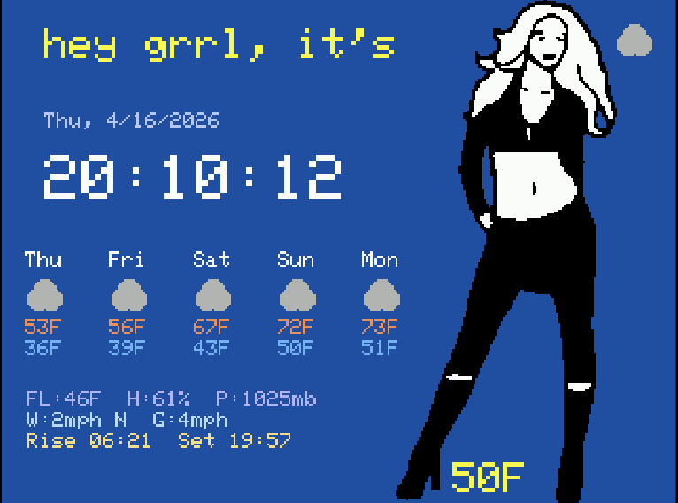

This is a simple weather info & forecast device. It supports info from the internet, and optionally local temp/humidity from a [AHTX Temperature/Humidity](https://www.amazon.com/dp/B0DXKYK1XB) sensor.



```sh
pip install platformio

pio run --target upload
```

Build this with a [CYD](https://www.aliexpress.us/w/wholesale-cyd.html), which you can usually get for about $20.

The default config is to use wifi to check weather and display it, but this idea could be extended to read sensors or display some other internet thing. If you hold your finger on screen while it boots, it will reset the wifi info.

Shows current temp, "feels like" temp, humidity, pressure, wind (speed & direction, gusts) and sun rise/set times, as well as forecast for the week, and what clothes are approprate.


## hookup

Your wiring might be a bit different (especially the temp-sensor.) If it's different, you might have to edit the source-code.

The [device I have](https://www.amazon.com/dp/B0G4ZC2FMM) has a single USBC, and no microUSB. with the USB on the left (so text is upright) there are 2 expansion ports on the top. It came with connector-plug like this:

```
Green Yellow Black Red
```

So, here is my mapping:

```
A B C D         E F G H
G Y B R (SPI) | G Y B R (P1)

27  - A
18  - B
19  - C
23  - D
GND - E
3V3 - H

21  - LCD backlight
35  - IN-only

LED on board (inverted: LOW=on)
22  - Red
16  - Green
17  - Blue
```

I found this with a multimeter and [pincheck](src/pincheck/):

```
pio run -e pincheck --target upload --target monitor
```

So temperature sensor is hooked up like this, with a custom plug:

```
18 - SCL  YELLOW
19 - SDA  GREEN
3V3       RED
GND       BLACK
```

I also included an i2c scanner for checking your i2c for a ATHX sensor:

```
pio run -e i2check --target upload --target monitor
```

